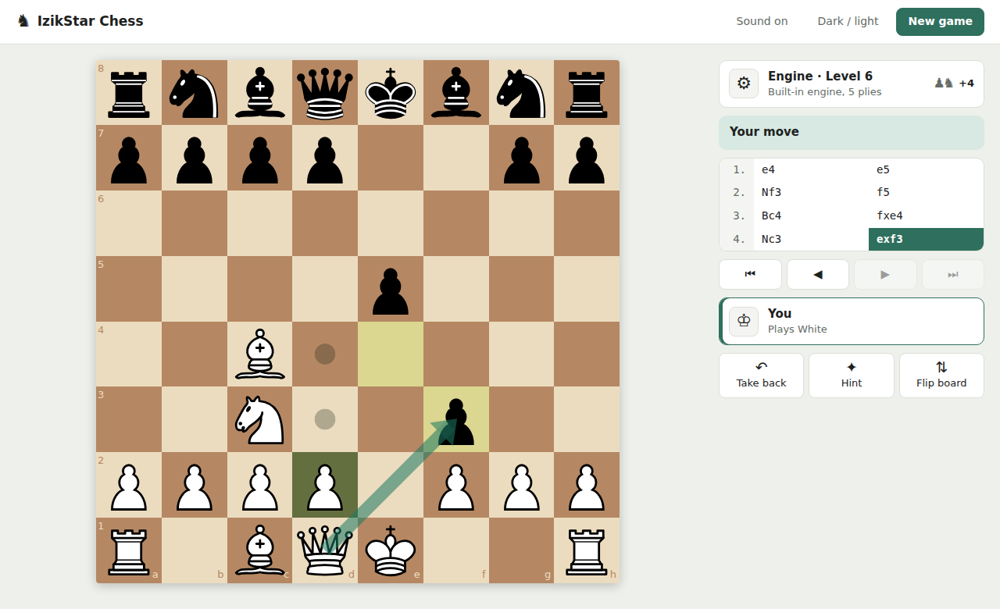
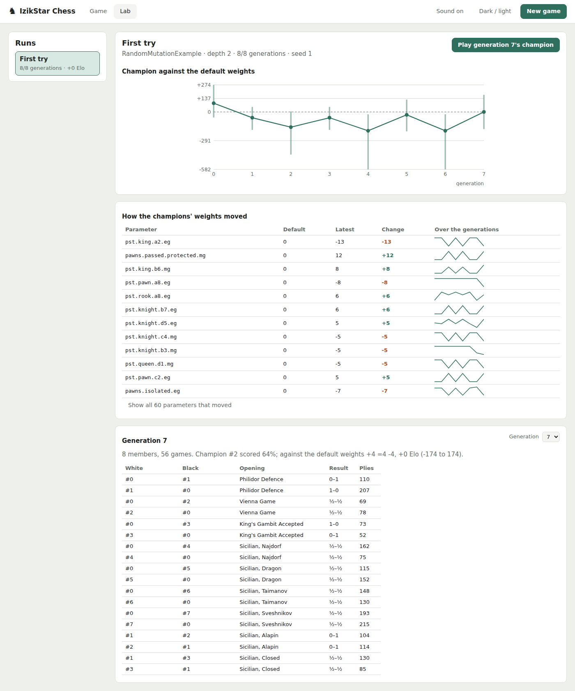

# IzikStar Chess

A chess game in Java with its own bitboard engine: legal move generation, alpha-beta search and
a hand-tuned evaluation. Stockfish can optionally take over the top difficulty levels. You play
in the browser: the jar starts a small local server and opens the game.



*An Italian Game in progress. Yellow marks the last move, dots show where the selected bishop
can go, and the green arrow is a hint the player asked for (castle).*

I started this as a personal project in 2024. It is now going through a planned, test-first
refactor, which is documented phase by phase in this repository (see
[Architecture and refactor](#architecture-and-the-ongoing-refactor)). This public repository
starts from a cleaned copy of the original private one; pull request numbers in the docs up to
Phase 4c (#2 to #6) refer to that repository.

## Features

- **Play against the computer or a friend**, or watch the engine play itself (each side at its
  own level). Pick White, Black or a random colour in the *New game* dialog.
- **10 difficulty levels.** The app opens on Level 4, a real but beatable opponent.
  - Level 1 plays random legal moves.
  - Levels 2-7 use the built-in engine and search deeper as the level rises.
  - Levels 8-10 hand the move to Stockfish if it is installed, and fall back to the built-in
    engine at Level 7 if it is not (the game tells you).
- **Full chess rules.** Castling, en passant, promotion (pick the piece on the board), check,
  checkmate and stalemate. Draws are detected by the 50-move rule, threefold repetition and
  insufficient material.
- **Click or drag** to move; the legal moves of the selected piece are marked.
- **Game analysis** with Stockfish: an evaluation bar beside the board, a graph, a mark on every
  move (best, inaccuracy, mistake, blunder) and per side an accuracy and a rough Elo estimate
  ([how it is computed](docs/game-analysis.md)).
- **Premoves.** While the engine thinks, queue your next moves (as many as you like, and a
  promotion asks for its piece); one is played each time it is your turn, if it is still legal,
  and an illegal one drops the rest. Click an empty square to cancel them.
- **Planning marks.** Right-click a square to mark it, right-drag to draw an arrow; a left click
  or the next move clears them.
- **Hints.** *Hint* draws an arrow for the engine's suggested move.
- **Take-backs**, a **flip board** button, and a **status line** that says whose move it is
  and when the engine is thinking.
- **Chess clocks.** Pick a time control in the *New game* dialog: untimed (the default), 1+0,
  3+2, 5+0, 10+0 or 15+10. The server keeps the time; the clocks start with the first move, and a
  flag fall loses the game (or draws it when the other side has only a king, or a king and one
  minor piece).
- **Resign and offer a draw.** Resigning asks first. The engine accepts a draw when the
  position has been seen before or its evaluation is +0.3 pawns or less for its side; once it
  declines, you move before offering again. Between two players the other side accepts or
  declines (a move declines it).
- **PGN.** Copy or download the game as PGN, or paste a PGN to load it (it becomes a game between
  two players, to review or play on from its last position).
- **Move list with review.** Click any move, or use the arrow keys, to see that position.
- **Captured pieces and material** on each player's card; the result in the side panel when
  the game ends.
- **Sound effects** (synthesised in the browser), **light and dark themes**, and a layout
  that works on a narrow window.

## How the engine works

Everything below describes code that runs today. Parts that exist but are not wired in yet are
marked as such.

### Board representation: bitboards

[`ai/BitBoard/BitBoard.java`](src/main/java/ai/BitBoard/BitBoard.java) stores a position as
twelve 64-bit `long` masks, one per piece type and colour. It also stores combined occupancy
masks, side to move, castling rights, the en-passant square and the move clocks. Making a move
returns a **new** `BitBoard`, so positions are immutable. That keeps the search free of
make/unmake bugs, at some cost in allocation.

### Move generation

Each piece type has a generator in [`ai/BitBoard/BitPiece/`](src/main/java/ai/BitBoard/BitPiece/):

- Knights, kings and pawns use shifts and file masks.
- Bishops, rooks and queens walk their rays one square at a time until they hit a piece.
- Castling, en passant and promotion are handled as special cases.

The generators first produce pseudo-legal moves. Any move that leaves the mover's own king on
an attacked square is then dropped, so only legal moves remain. Whether a square is attacked
comes from [`Attacks`](src/main/java/ai/BitBoard/Attacks.java): lookup tables for knights, kings
and pawns, and ray walks for bishops, rooks and queens.

Perft tests count the moves to a fixed depth in 23 positions and compare the totals with the
published values and with Stockfish (Phase 4b).

Since Phase 2 of the refactor, this generator is the **only** rules authority in the program.
The headless [`rules`](src/main/java/rules/) package wraps it in a small API with no Swing or
AWT dependency: give it a FEN string, and `rules.Rules` returns the legal moves (in UCI notation,
e.g. `e2e4`), the position status (check, mate, stalemate or draw) and the position after a move.

### Search

[`ai/Minimax.java`](src/main/java/ai/Minimax.java) runs a **minimax search with alpha-beta
pruning** over bitboard positions:

- **Transposition table.** The depths of one search share a table keyed by a Zobrist hash of
  everything the evaluation reads (pieces, side to move, castling rights, en passant, move
  number). A position already searched deeply enough returns its stored score or bound, and every
  position tries first the move that was best there one depth earlier. Up to 16 MB per search.
- **Move ordering.** After the table's move: captures, most valuable victim first and cheapest
  attacker first; then the two "killer" quiet moves that cut the search off at the same ply; then
  quiet moves by how often they cut off elsewhere (history). With the table this makes the
  middlegame search at depth 6 about 5 times faster, and it finds the same score as before at
  every depth ([Phase 5b research](docs/phase-5b-research.md)).
- **Depth and time.** Depth comes from the difficulty level, from 1 ply at level 2 to 6 plies at
  level 7, and 1-2 plies deeper once the board thins out to 12 or fewer pieces. The search
  deepens one ply at a time and stops after 5 seconds, playing the move of the deepest depth it
  finished; it also stops at once when the game moves on (take-back, new game). Level 6 finishes
  its full depth in well under a second and Level 7 its depth 6 in under 1.5 seconds in the
  benchmark positions.
- **Quiescence.** When the depth runs out the search does not stop in the middle of an
  exchange: it plays on through captures and queen promotions until the position is quiet, so
  it never counts a piece that is about to be taken back. At the same depth this wins about 90%
  of the points against the search without it.
- **Repetition.** Positions get Zobrist hashes
  ([`ZobristHashing`](src/main/java/ai/BitBoard/ZobristHashing.java)). A per-branch stack
  ([`BoardStateTracker`](src/main/java/ai/BoardStateTracker.java)) uses them to spot threefold
  repetition inside the search tree.
- **Variety.** Any root move scoring within 0.2 pawn of the best may be played, picked at
  random, so the engine does not repeat the same game. It never passes up a forced mate.

### Evaluation

[`ai/BitBoard/BitBoardEvaluate.java`](src/main/java/ai/BitBoard/BitBoardEvaluate.java) scores a
position with hand-written terms, mostly computed with bit masks and popcounts. Since Phase 5
every weight is a named, bounded parameter (about 500 of them, saved and loaded as JSON), each
with a middlegame and an endgame value blended by the material left; the defaults reproduce the
hand-tuned engine, and new terms start at 0 for evolution to switch on. The terms:

- material (P=10, N=30, B=33, R=50, Q=90)
- pawn advancement, with a bonus for central pawns
- king placement in the opening (castled-side squares are preferred)
- castling, and castling rights lost
- mobility and threats: how many squares each side attacks, and which enemy and own pieces are
  under attack
- development: knights and bishops off the back rank, an early queen sortie penalised, knights
  on their natural squares

Checkmate and stalemate are scored as terminal values.

### Opening book

There is an [`ai/openingBook`](src/main/java/ai/openingBook/) package: a file-backed book
format and a Retrofit/OkHttp client for the Lichess API. **It is not used during play yet.** Nothing
calls it, and wiring it in is planned for Phase 5.

### Stockfish bridge

[`engine/StockfishEngine.java`](src/main/java/engine/StockfishEngine.java) starts a Stockfish
process and talks to it over the UCI protocol through stdin and stdout. The suggested move is
checked against the program's own rules before it is played. One Stockfish process serves the
whole session: the UCI handshake runs once, and each move sends the game's moves so far.
Levels 8-10 set Stockfish's skill level to 13, 15 and 17 and let it think 300, 600 and 1000 ms;
hints use full strength and 1000 ms. If Stockfish crashes it is restarted, and if it is missing or
keeps failing the built-in engine takes over.

## Architecture and the ongoing refactor

```
src/main/java/
├── rules/          headless rules API: FEN in, legal moves / status / SAN out; one game's history
├── ai/             Minimax search and evaluation over bitboards
│   ├── BitBoard/   bitboard position, per-piece move generators, attack tables
│   └── openingBook/  (not wired in yet)
├── engine/         Engine interface: the built-in search, Stockfish, and which one plays a level
├── game/           GameSession: turn-taking, the engine thread, events for any front end
└── web/            local web server: the browser UI's files, and the game over one WebSocket
web/                the browser UI: React + TypeScript (Vite), board by react-chessboard
```

Lower layers never import higher ones, and nothing below `web` imports Swing, AWT or the web
server; a test (`architecture.LayeringTest`) fails the build otherwise. The browser never
decides what is legal: the server sends it the legal moves with every position.

The code started as a single-developer IntelliJ project that grew features faster than
structure. Two documents describe it honestly instead of hiding the problems:

- **[ARCHITECTURE.md](ARCHITECTURE.md)** maps the system as it actually is, including its
  flaws, ranked: UI and game logic mixed together, global mutable state reaching into the
  search, and inconsistent concurrency.
- **[REFACTOR_GUIDE.md](REFACTOR_GUIDE.md)** is the phased plan to fix it. Each phase requires
  a research step, a test safety net and explicit exit criteria.

| Phase | Goal | Status |
|---|---|---|
| 0 | Maven build + characterization test suite | Done ([notes](docs/phase-0-notes.md)) |
| 1 | Remove dead and duplicate code | Done ([notes](docs/phase-1-notes.md)) |
| 2 | One board model and one rules engine; fix draw detection | Done ([research](docs/phase-2-research.md)) |
| 3 | Decouple the UI from the rules; retire global state | Done ([research](docs/phase-3-research.md)) |
| 4 | One concurrency model; a proper Stockfish session | Done ([research](docs/phase-4-research.md)) |
| 4b | Fix the move generator's rule bugs; make the search fast enough for Levels 6-7 | Done ([research](docs/phase-4b-research.md)) |
| 4c | Replace the Swing screens with a browser UI | Done ([research](docs/ui-research.md)) |
| 5 | Groundwork for an engine that learns by self-play evolution | In progress: parameters, quiescence, arena, run record and lab page done ([research](docs/phase-5-research.md)) |

Phase 2 is a good example of the approach:

- **Before:** three independent check/mate/draw implementations that could disagree with each
  other.
- **Process:** characterization tests first, then the three implementations collapsed into one.
- **Result:** four draw-detection bugs and two bitboard move-generation bugs fixed (queen
  attack rays, and en passant).

## Build and run

You need JDK 21 or newer (`maven.compiler.release` in `pom.xml`). The Maven wrapper is included, so you do not need to install Maven.

```bash
./mvnw package                            # build target/izikstar-chess-3.1.0.jar (runs the tests)
java -jar target/izikstar-chess-3.1.0.jar # play: opens http://localhost:7070/ in your browser
```

On Windows use `.\mvnw.cmd` (PowerShell needs the `.\`); double-clicking the jar works too. The first `package` downloads its
own Node.js into `target/` to build the browser UI (`-Dskip.web=true` skips that step). The
server listens on this computer only; stop it with Ctrl+C or by closing its console. Options:
`--port N`, `--no-browser`.

Run the jar from the repository root if you want it to find Stockfish at the default path.

**Working on the browser UI:** run the jar (`--no-browser`), then `npm run dev` in `web/` and
open <http://localhost:5173/>; changes show up as you save.

## Arena: engine against engine

The arena plays two sets of evaluation weights against each other over a suite of about fifty
openings, each opening once with each colour, several games at a time, and reports the score with
an Elo difference and its 95% interval:

```bash
./mvnw package -DskipTests
java -cp target/izikstar-chess-3.1.0.jar arena.Cli match default my-weights.json --depth 3
```

`default` is the built-in weights; a JSON file names the parameters it changes (the rest keep
their defaults). Options: `--depth`, `--openings`, `--threads`, `--max-plies`, `--variety`,
`--seed` (the same seed replays the same games), `--old-search A|B` (that side searches without
quiescence).

## Evolution runs and the lab page

An evolution run lets an algorithm breed sets of weights: each generation plays a tournament,
and the algorithm builds the next generation from the results. The algorithm is a class that
implements [`evolution.Evolution`](src/main/java/evolution/Evolution.java);
[`RandomMutationExample`](src/main/java/evolution/RandomMutationExample.java) is a deliberately
naive one. Every member, game and result goes into one SQLite file per run:

```bash
java -cp target/izikstar-chess-3.1.0.jar lab.Cli run runs/first.db --algorithm evolution.RandomMutationExample --generations 20
java -cp target/izikstar-chess-3.1.0.jar lab.Cli resume runs/first.db   # after Ctrl+C
java -cp target/izikstar-chess-3.1.0.jar lab.Cli export runs/first.db positions.csv
java -cp target/izikstar-chess-3.1.0.jar lab.Cli champion runs/first.db 19 champion.json
```

[docs/evolution-guide.md](docs/evolution-guide.md) explains the API, the numbers and the traps.

The **Lab** tab of the web app (it reads `runs/`, or `--runs DIR`) shows each run as it goes: the
champion's Elo against the default weights with its error bar, how the champions' weights moved,
and every game, which you can replay on the board. **Play the champion** starts a game against
any generation's best set of weights.



## Tests

```bash
./mvnw test               # main suite: must be green
./mvnw test -Psmoke       # end-to-end smoke tests: must be green
./mvnw test -Pstress      # long runs, several minutes: must be green
./mvnw test -Pknown-bugs  # tests that pin known bugs (currently none; see below)
```

- **Characterization tests** ([`src/test/java/characterization/`](src/test/java/characterization/))
  were written *before* the refactor started. They pin down what the program actually does in
  well-known positions, so any behaviour change during the refactor shows up as a test failure.
  The positions include the start position, Fool's mate, back-rank mate, stalemate, castling, en
  passant, promotion, repetition, insufficient material, the 50-move rule and SAN `+`/`#`
  suffixes. The tests check both entry points to the rules (the object model and the bitboard)
  and require them to agree.
- **Rules tests** ([`src/test/java/rules/RulesTest.java`](src/test/java/rules/RulesTest.java))
  cover the headless `rules` API directly.
- **Perft tests** ([`RulesPerftTest`](src/test/java/rules/RulesPerftTest.java),
  [`SearchPerftTest`](src/test/java/ai/BitBoard/SearchPerftTest.java)) count every legal move
  sequence to a fixed depth from 23 positions, through the `rules` API and through the search's
  own move list, and compare with published counts and Stockfish.
  [`MoveGenerationBugsTest`](src/test/java/rules/MoveGenerationBugsTest.java) has one test per
  move-generator bug that perft found in Phase 4b.
- **Same-move test** ([`SameMoveTest`](src/test/java/engine/SameMoveTest.java)) holds the
  engine's move at depths 1-4 in 56 positions, so a change meant only to make the search faster
  cannot quietly change how it plays.
- **Stress tests** (`-Pstress`) play unattended engine-vs-engine games, storm the game with moves,
  take-backs and hint requests, and run perft as deep as the reference counts go. They also
  compare 300 random games with Stockfish's legal moves at every ply, and time Levels 6 and 7
  ([`SearchSpeedTest`](src/test/java/engine/SearchSpeedTest.java)).
- **Smoke tests** ([`AppSmokeTest`](src/test/java/characterization/AppSmokeTest.java)) play a
  scripted game to checkmate, and play a full random game inside the bitboard engine.
- **Known-bug tests** are tagged `known-bug`. They assert the *correct* behaviour and are
  expected to fail until a phase fixes the bug. The four from Phase 0 were all fixed in Phase 2
  and became regular tests, so the profile is currently empty.

- **Web server tests** ([`WebServerTest`](src/test/java/web/WebServerTest.java)) drive whole
  games through the WebSocket the way the browser does, with no browser.
- **Browser tests** ([`web/e2e/`](web/e2e/)) play real games in Chromium against the packaged
  jar: checkmate, drag and click moves, promotion, the engine's reply, take-back, review,
  clocks and a flag fall, resigning, draw offers, and PGN copy, download and load.
  After `./mvnw package`, run them in `web/` with `npx playwright install chromium` (once) and
  `npm run e2e`.

Tests run with `-Djava.awt.headless=true`, so no display is needed.

## Optional: Stockfish

Stockfish is **not** included in this repository. It is a large third-party GPLv3 binary.
Without it the game is fully playable: levels 8-10 play the built-in engine at Level 7 and hints
use the built-in engine. The New game dialog and the player card say so when Stockfish is missing,
and the server prints which Stockfish it found when it starts.

1. Download Stockfish for your OS from <https://stockfishchess.org/download/>.
2. Unzip it into the `engine/` folder of the repository. Any file whose name starts with
   `stockfish` is found, also one folder down, so the download's own
   `engine/stockfish/stockfish-windows-x86-64-avx2.exe` works as it is. The `engine/` folder is
   looked for next to the directory you run from and next to the jar, so double-clicking
   `target/izikstar-chess-3.1.0.jar` finds it too.
3. Or install it so that `stockfish` is on your `PATH` (Linux: `sudo apt install stockfish`;
   macOS: `brew install stockfish`).
4. Or name the file yourself: `java -Dstockfish.path=/path/to/stockfish -jar target/izikstar-chess-3.1.0.jar`,
   or the `STOCKFISH_PATH` environment variable.


## Roadmap

- **Phase 5:** make every evaluation weight a parameter (about 500 of them), a self-play arena
  that plays many games in parallel, a record of every run, and a lab screen to watch the
  engine evolve and play its champion. The evolution algorithm itself is mine to write.
- **Phase 6:** a small neural network that reads the board, trained and evolved on the games the
  arena records.
- **Later:** the online opening book.
- **Longer term:** split the headless `rules`/engine core into a backend service behind the
  web front end that Phase 4c started.

## License

MIT, see [LICENSE](LICENSE).

The chess pieces are original artwork drawn for this project and covered by the same MIT
license: the board's glossy black-and-ivory set is drawn in code by
[`web/src/pieces.tsx`](web/src/pieces.tsx), and an earlier original set is kept in
[`docs/art/pieces.svg`](docs/art/pieces.svg). The sound effects are synthesised in the browser by
[`web/src/sounds.ts`](web/src/sounds.ts), so the repository ships no third-party sound files.

Stockfish is a separate project licensed under the GPLv3 and is not distributed here.
