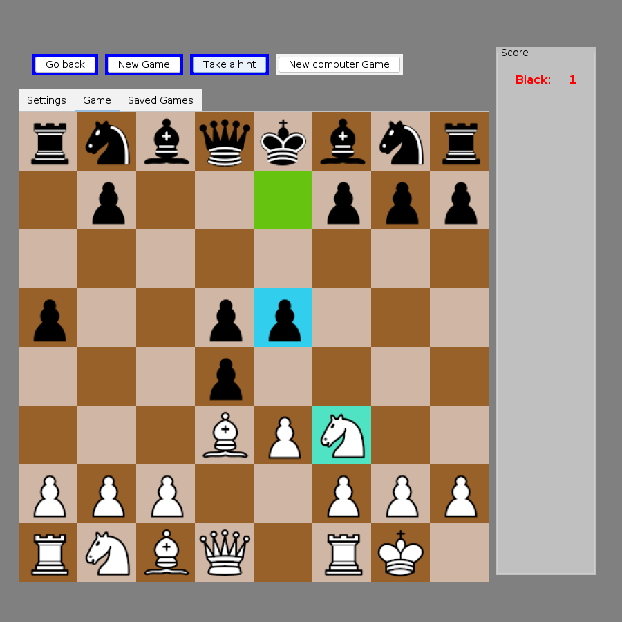

# IzikStar Chess

A desktop chess game in Java with its own bitboard engine: legal move generation, alpha-beta
search and a hand-tuned evaluation. Stockfish can optionally take over the top difficulty levels.



*The board mid-game. Green marks the engine's last move (...e5). Cyan is a hint the player
asked for (Nxe5).*

I started this as a personal project in 2024. It is now going through a planned, test-first
refactor, which is documented phase by phase in this repository (see
[Architecture and refactor](#architecture-and-the-ongoing-refactor)).

## Features

- **Play against the computer or a friend.** Choose one or two players, and play as White or
  Black.
- **10 difficulty levels.**
  - Level 1 plays random legal moves.
  - Levels 2-7 use the built-in engine and search deeper as the level rises.
  - Levels 8-10 hand the move to Stockfish if it is installed, and fall back to the built-in
    engine if it is not.
- **Full chess rules.** Castling, en passant, promotion with a piece-choice dialog, check,
  checkmate and stalemate. Draws are detected by the 50-move rule, threefold repetition and
  insufficient material.
- **Hints.** The *Take a hint* button highlights a suggested move for you.
- **Take-backs.** *Go back* undoes moves.
- **Move list.** A *Saved Games* tab shows the current game in algebraic notation, including
  `+`, `#` and draw markers.
- **Computer vs. computer** mode.
- **Animations, sound effects** and a material score panel.

## How the engine works

Everything below describes code that runs today. Parts that exist but are not wired in yet are
marked as such.

### Board representation: bitboards

[`ai/BitBoard/BitBoard.java`](src/main/java/ai/BitBoard/BitBoard.java) stores a position as
twelve 64-bit `long` masks, one per piece type and colour. It also stores combined occupancy
masks, side to move, castling rights, the en-passant square and the move clocks. Making a move
returns a **new** `BitBoard`, so positions are immutable. That keeps the search free of
make/unmake bugs, at some cost in allocation.

### Move generation

Each piece type has a generator in [`ai/BitBoard/BitPiece/`](src/main/java/ai/BitBoard/BitPiece/):

- Knights, kings and pawns use shifts and file masks.
- Bishops, rooks and queens walk their rays one square at a time until they hit a piece.
- Castling, en passant and promotion are handled as special cases.

The generators first produce pseudo-legal moves. Any move that leaves the mover's own king on
an attacked square is then dropped, so only legal moves remain.

Since Phase 2 of the refactor, this generator is the **only** rules authority in the program.
The headless [`rules`](src/main/java/rules/) package wraps it in a small API with no Swing or
AWT dependency: give it a FEN string, and `rules.Rules` returns the legal moves (in UCI notation,
e.g. `e2e4`), the position status (check, mate, stalemate or draw) and the position after a move.

### Search

[`ai/Minimax.java`](src/main/java/ai/Minimax.java) runs a **minimax search with alpha-beta
pruning** over bitboard positions:

- **Move ordering.** Child positions are sorted by a cheap move score before they are searched,
  which makes cut-offs happen sooner. Checks come first, then captures by the value of the
  captured piece. Moves that give up castling rights score lower.
- **Depth.** Depth comes from the difficulty level, from 1 ply at level 2 to 6 plies at level 7.
  The engine searches 1-2 plies deeper once the board thins out to 12 or fewer pieces.
- **Repetition.** Positions get Zobrist hashes
  ([`ZobristHashing`](src/main/java/ai/BitBoard/ZobristHashing.java)). A per-branch stack
  ([`BoardStateTracker`](src/main/java/ai/BoardStateTracker.java)) uses them to spot threefold
  repetition inside the search tree.
- **Variety.** When several root moves share the best score, the engine picks one at random so
  it does not repeat the same game every time.

**Not wired in yet:**

- A [`TranspositionTable`](src/main/java/ai/TranspositionTable.java) keyed by the same Zobrist
  hash exists, but its calls in `minimax()` are commented out. Hooking it in is part of Phase 4.
- There is no iterative deepening and no quiescence search yet.

### Evaluation

[`ai/BitBoard/BitBoardEvaluate.java`](src/main/java/ai/BitBoard/BitBoardEvaluate.java) scores a
position with hand-written terms, mostly computed with bit masks and popcounts:

- material (P=10, N=30, B=33, R=50, Q=90)
- pawn advancement, with a bonus for central pawns
- king placement in the opening (castled-side squares are preferred)
- castling, and castling rights lost
- mobility and threats: how many squares each side attacks, and which enemy and own pieces are
  under attack
- development: knights and bishops off the back rank, an early queen sortie penalised, knights
  on their natural squares

Checkmate and stalemate are scored as terminal values.

### Opening book

There is an [`ai/openingBook`](src/main/java/ai/openingBook/) package: a file-backed book
format and a Retrofit/OkHttp client for the Lichess API. **It is not used during play yet.** The
call site in `myEngine` is commented out, and finishing it is planned for Phase 5.

### Stockfish bridge

[`ai/StockfishEngine.java`](src/main/java/ai/StockfishEngine.java) starts a Stockfish process
and talks to it over the UCI protocol through stdin and stdout. The suggested move is checked
against the program's own rules before it is played. The integration is basic so far: it
re-handshakes on every move, uses a fixed 150 ms move time, and levels 8-10 currently share
the same Stockfish strength setting. Phase 4 of the refactor is about fixing this.

## Architecture and the ongoing refactor

```
src/main/java/
├── rules/          headless rules API (FEN in -> legal moves / status out); no Swing
├── ai/             engine: Minimax, evaluation, Stockfish bridge, myEngine orchestrator
│   ├── BitBoard/   bitboard position + per-piece move generators
│   └── openingBook/  (not wired in yet)
├── pieces/         piece objects used by the renderer
├── main/           Swing board, input handling, move/notation bookkeeping, settings
└── GUI/            audio, animation, custom buttons
```

The code started as a single-developer IntelliJ project that grew features faster than
structure. Two documents describe it honestly instead of hiding the problems:

- **[ARCHITECTURE.md](ARCHITECTURE.md)** maps the system as it actually is, including its
  flaws, ranked: UI and game logic mixed together, global mutable state reaching into the
  search, and inconsistent concurrency.
- **[REFACTOR_GUIDE.md](REFACTOR_GUIDE.md)** is the phased plan to fix it. Each phase requires
  a research step, a test safety net and explicit exit criteria.

| Phase | Goal | Status |
|---|---|---|
| 0 | Maven build + characterization test suite | Done ([notes](docs/phase-0-notes.md)) |
| 1 | Remove dead and duplicate code | Done ([notes](docs/phase-1-notes.md)) |
| 2 | One board model and one rules engine; fix draw detection | Done ([research](docs/phase-2-research.md)) |
| 3 | Decouple the UI from the rules; retire global state | Next |
| 4 | One concurrency model; a proper Stockfish session; transposition table | Planned |
| 5 | Opening book in play; structured game database | Planned |

Phase 2 is a good example of the approach:

- **Before:** three independent check/mate/draw implementations that could disagree with each
  other.
- **Process:** characterization tests first, then the three implementations collapsed into one.
- **Result:** four draw-detection bugs and two bitboard move-generation bugs fixed (queen
  attack rays, and en passant).

## Build and run

You need JDK 21 or newer (`maven.compiler.release` in `pom.xml`). The Maven wrapper is included, so you do not need to install Maven.

```bash
./mvnw package                            # build target/izikstar-chess-3.1.0.jar (runs the tests)
java -jar target/izikstar-chess-3.1.0.jar # play
# or
./mvnw exec:java
```

On Windows use `mvnw.cmd`.

Run the jar from the repository root if you want it to find Stockfish at the default path.

Some end-of-game messages in the UI are in Hebrew.

## Tests

```bash
./mvnw test               # main suite: must be green (49 tests)
./mvnw test -Psmoke       # end-to-end smoke tests: must be green (3 tests)
./mvnw test -Pknown-bugs  # tests that pin known bugs (currently none; see below)
```

- **Characterization tests** ([`src/test/java/characterization/`](src/test/java/characterization/))
  were written *before* the refactor started. They pin down what the program actually does in
  well-known positions, so any behaviour change during the refactor shows up as a test failure.
  The positions include the start position, Fool's mate, back-rank mate, stalemate, castling, en
  passant, promotion, repetition, insufficient material, the 50-move rule and SAN `+`/`#`
  suffixes. The tests check both entry points to the rules (the object model and the bitboard)
  and require them to agree.
- **Rules tests** ([`src/test/java/rules/RulesTest.java`](src/test/java/rules/RulesTest.java))
  cover the headless `rules` API directly.
- **Smoke tests** ([`AppSmokeTest`](src/test/java/characterization/AppSmokeTest.java)) play a
  scripted game to checkmate, play a full random game inside the bitboard engine, and
  round-trip a saved game.
- **Known-bug tests** are tagged `known-bug`. They assert the *correct* behaviour and are
  expected to fail until a phase fixes the bug. The four from Phase 0 were all fixed in Phase 2
  and became regular tests, so the profile is currently empty.

Tests run with `-Djava.awt.headless=true`, so no display is needed.

## Optional: Stockfish

Stockfish is **not** included in this repository. It is a large third-party GPLv3 binary.
Without it the game is fully playable: levels 8-10 and hints fall back to the built-in engine.

1. Download Stockfish for your OS from <https://stockfishchess.org/download/>.
2. Tell the game where it is, using any one of these:
   - put the Windows build at `engine/stockfish-windows-x86-64.exe` (the default path, relative
     to the directory you run from);
   - pass a system property: `java -Dstockfish.path=/path/to/stockfish -jar target/izikstar-chess-3.1.0.jar`;
   - set an environment variable: `export STOCKFISH_PATH=/path/to/stockfish`.

On Linux, `sudo apt install stockfish` installs it at `/usr/games/stockfish`.

## Roadmap

- **Phase 3:** split `Board` (currently both a Swing panel and the move executor) from the game
  logic, and replace the global settings that the search reads with parameters.
- **Phase 4:** a single concurrency model, which fixes the documented "engine stops moving
  when it is losing" bug. Also a persistent Stockfish session with proper strength levels, and
  the transposition table switched on.
- **Phase 5:** use the opening book during play, and store games in a structured, queryable
  form.
- **Longer term:** split the headless `rules`/engine core into a backend service with a web
  (React) front end.

## License

MIT, see [LICENSE](LICENSE). The license covers the source code only.

The piece images (`src/main/resources/pieces.png`) and the sound effects
(`src/main/resources/sounds/`) are third-party assets collected for a learning project. They
are not covered by the MIT license, and their original authors keep their rights. If you are an
author and want an asset credited or removed, please open an issue.

Stockfish is a separate project licensed under the GPLv3 and is not distributed here.
