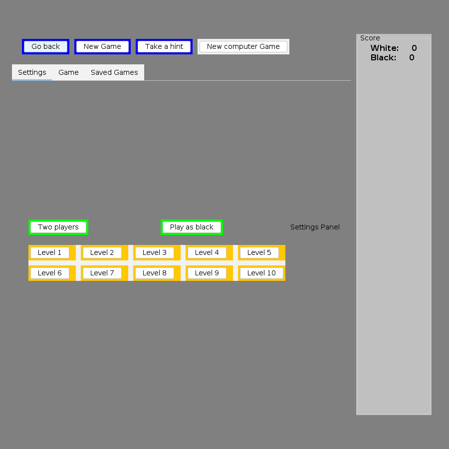
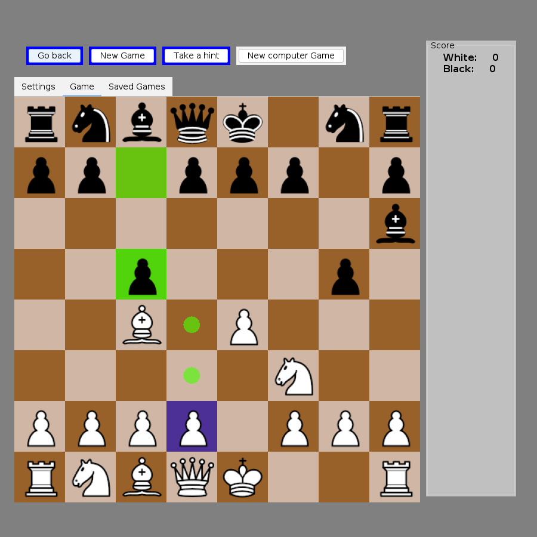
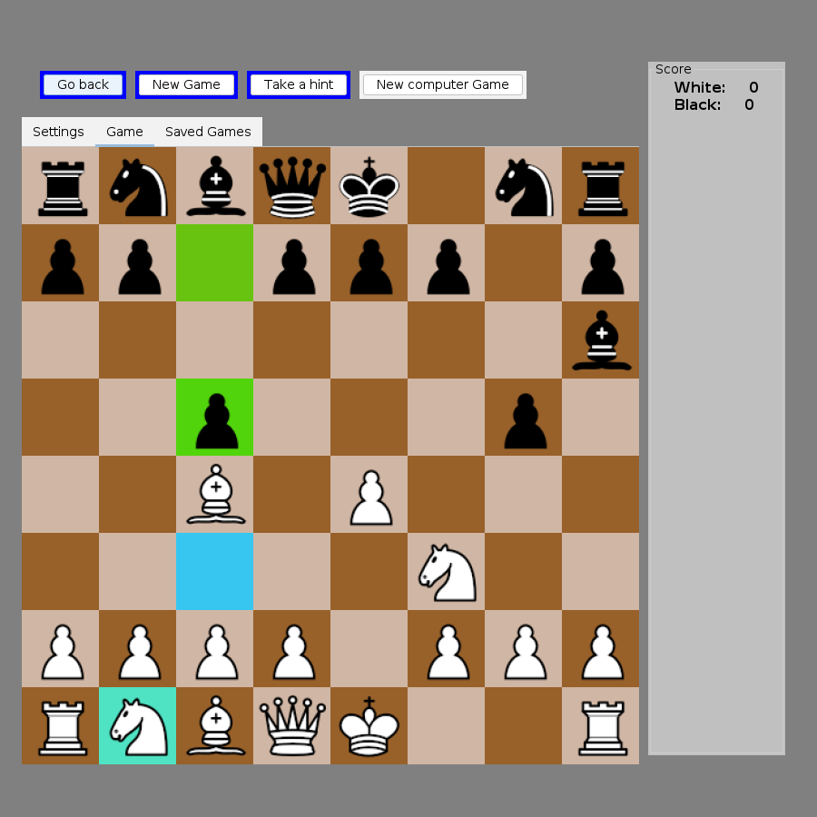
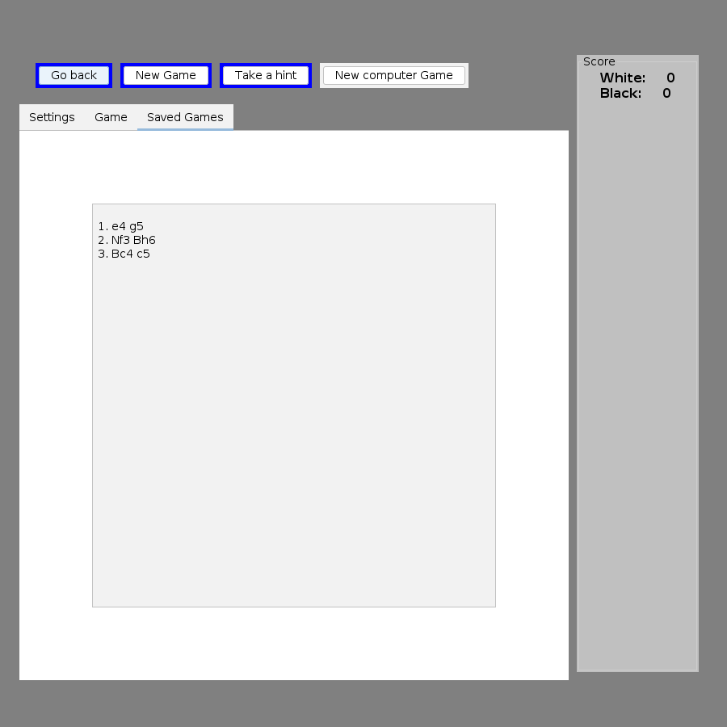

# UI/UX research — what is wrong with the game screen, and what to build next

Status: **decisions locked 2026-10-02 — the owner approved every recommendation in §6** (U1 web UI,
U2 before Phase 5, U3 Javalin, U4 react-chessboard, U5 English, U6 Swing kept until parity then
deleted, U7 the listed first slice). Implementation is Phase 4c in REFACTOR_GUIDE.md; the
increment log is §8.
Written 2026-10-02 against `master` at `e0965d5` (Phase 4b merged).

The owner's ask: the current UX/UI is bad and should improve dramatically; what is the next step?

## 1. How the UI looks today

Screenshots taken from the packaged app under a virtual display (`xvfb-run`, 1600x1000), driving
it through `GameSession` (three moves, a selected piece, a hint):

| Opening screen | Mid-game, piece selected | Hint | "Saved Games" tab |
|---|---|---|---|
|  |  |  |  |

The whole UI is ~1,100 lines in `main/` and `GUI/`: `Main` (frame, buttons, score panel),
`Board` (painting + session events), `Input` (mouse), `SettingPanel`, `SavedGamesPanel` /
`ShowCurrentGame` (move list), `PromotionDialog`, `AudioPlayer`, `ChessAnimation`,
`PieceSprites`. Since Phase 3 none of it holds rules or game state: everything goes through
`game.GameSession` and comes back as `GameListener` events. That is what makes a redesign cheap
now (§4).

## 2. What is wrong (audit)

### Layout and navigation
1. **The app opens on the Settings tab, not the board.** The first thing a player sees is a grey
   screen with green and orange buttons; the board is behind the second tab.
2. **Board, settings and move list are three tabs of one pane**, so you can never see the board
   and the moves at the same time, and changing a setting means leaving the board.
3. **Fixed 85 px squares** (`Board.tileSize`); the board does not scale with the window. The
   frame asks to be maximised but the board stays 680 px, with large dead grey areas.
4. **The "Score" panel is a tall empty grey column** showing only material difference.
5. A leftover `JLabel("Settings Panel")` is printed inside the settings tab (`Main.java:51`).
6. The "New computer Game" button is the only unstyled button: `styleButton(newGameButton)` is
   called twice instead of once for `computerGameButton` (`Main.java:95`).

### Missing information
7. **No turn indicator, no status line.** Nothing says whose move it is, that the engine is
   thinking, or that a hint is being computed (a Stockfish hint can take seconds).
8. **No current-level indicator.** Ten "Level N" buttons; none shows which one is active.
   "Play as black" / "Two players" are toggles labelled with the *other* state, so the screen
   never says what the current mode or colour is.
9. **No coordinates** (a–h, 1–8) on the board.
10. **"Saved Games" is not saved games.** It is the current game's move list as plain text;
    `SaveGame`/`LoadGame` exist but nothing in the UI calls them.
11. No captured pieces, no player names/labels, no clock.

### Board feedback
12. **Colours fight each other**: last move is saturated green (alpha 158/186), the selected
    square is a blue overlay that turns the brown square purple, legal-move dots are the same
    green as the last move, captures are a 5 px red frame, the hint is cyan + turquoise, check
    is a red frame. Six colour codes, none of them conventional.
13. **Game over is a modal `JOptionPane`** in Hebrew while every button is in English; after
    dismissing it there is no result shown anywhere except a "1-0" line in the move list tab.
14. The promotion dialog is a separate window with "q r b n" text labels.
15. In two-player mode the board **flips automatically after every move** with a sound and a
    one-second delay; there is no manual flip button for the other modes.

### Controls
16. "Go back" takes back a move pair silently and does nothing (prints to stdout) while the
    engine is thinking — the button looks dead.
17. No resign, no offer-draw, no flip board, no copy FEN/PGN, no review (stepping back through
    moves without undoing them).
18. Mixed languages: English buttons, Hebrew dialogs and dialog titles.

### Look and feel
19. FlatLaf Light is installed, then overridden with `Color.gray` backgrounds, pure `Color.blue`
    / `Color.green` / `Color.orange` panels and Arial everywhere, which is why it looks like a
    1998 form. No dark theme, no consistent spacing.

Items 5, 6 and 13 are plain bugs; the rest are design.

## 3. What "good" looks like

The reference every chess player knows is lichess / chess.com. Their game screen has one layout:

- **The board is the page.** Big, square, scales with the window, coordinates on the edge.
- **One side panel** next to it: opponent card on top (name, level, captured pieces, material
  +N), the move list in the middle (two columns, SAN, current move highlighted, click a move to
  view that position), your card at the bottom, and a row of icon buttons (take back, flip,
  hint, resign/new game).
- **A status line** always visible: "White to move", "Engine is thinking…", "Check!",
  "Checkmate — Black wins".
- **Quiet, conventional highlights**: last move as a soft yellow tint on both squares, legal
  targets as small grey dots (rings on captures), selected square tinted, check as a red glow
  under the king, hint as an arrow.
- **New game is a dialog** (opponent: engine / friend; colour: white / black / random; level as
  a slider with names), not a permanent settings page.
- **Game over** shows the result in the panel with "Rematch" and "Review" buttons, not a modal.
- **Promotion** picks the piece in place, over the promotion square.

A clickable mockup of this layout, using the same position as the screenshots above, is
published at <https://claude.ai/artifact/8KC9yQbTStkVDeZSAXsL1W> (private to the owner); its
source is `docs/ui-mockup.html`.

## 4. Options

All three options keep `GameSession` / `GameListener` as the only contract with the core, so
none of them touches `rules`, `engine` or `ai`.

### Option A — Redesign inside Swing

Rewrite `Main`/`Board`/panels as one screen: scalable board with coordinates, side panel
(players, `JList` move list with review, icon buttons), status bar, new-game and game-over
dialogs, FlatLaf dark/light with a real palette, SVG pieces (FlatLaf has `FlatSVGIcon`).

- **For:** smallest step; no new language or toolchain; the jar stays a double-click app.
- **Against:** it is the UI the project has already said it will replace (long-term goal: React
  front-end + services). Every hour spent here is thrown away, and Swing makes the parts that
  matter most for "feels modern" (smooth animation, drag shadows, responsive layout, arrows)
  the most expensive to get right. Phase 5's game database will need a games browser, which
  would then be built twice.

### Option B — Go straight to a web UI (recommended)

A small local server in the same Java process wraps the existing `GameSession`; a React +
TypeScript single-page app is the new UI. The jar starts the server and opens the browser, so
for the owner it is still one double-click.

- **Server:** one HTTP + WebSocket endpoint. Commands in (move, undo, new game, hint, config,
  resign); `GameListener` events out (moveMade, positionReset, hint, gameOver, configChanged),
  each with the full state (FEN, legal moves, move list with SAN, status, whose turn, engine
  thinking). The server stays authoritative: the browser never re-implements chess rules, it
  only shows the legal moves the server sends — the same "one rules engine" decision as
  Phase 2.
- **Client:** React + TypeScript + Vite; an MIT-licensed board component (`react-chessboard`)
  or a hand-written SVG board; the layout of §3; existing sounds and piece art reused or
  replaced.
- **Build:** the Maven build runs the front-end build (`frontend-maven-plugin`, which downloads
  its own Node) and packs the static files into the jar, so `mvn package` stays the one command.
  During development, the Vite dev server proxies to the Java server.
- **For:** this *is* the first step of the stated long-term architecture (a backend with an API +
  a React UI), done at the smallest useful size: one process, one user, no accounts, no
  micro-services yet. It is also the cheapest way to get a UI that looks like lichess, and
  Phase 5's opening names and games browser land directly in it.
- **Against:** a new toolchain (Node/TypeScript) in the repo; the first slice is bigger than
  Option A's; browser-only (no native window). Swing stays in the repo, runnable, until the
  web UI reaches parity, then it is deleted (strangler, same as earlier phases).

### Option C — Quick Swing fixes now, web UI next

Fix the bugs and the worst design items in Swing (open on the board, board + move list side by
side, status line, level indicator, softer highlights, coordinates) as a short pass, then do
Option B.

- **For:** something better to play on right away.
- **Against:** most of it is thrown away when B lands; it delays B.

### Not considered

JavaFX (a second desktop toolkit with the same throw-away problem as A), Electron/Tauri
wrappers (can be added later around Option B's page if a native window ever matters), a hosted
multi-user server (that is the later micro-services phase; Option B keeps the API shape it will
need).

## 5. Where this goes in REFACTOR_GUIDE.md

The guide's next phase is **Phase 5 — opening book in play + structured game database**. Both
have UI: opening names under the board, a list of past games to open and review. If Phase 5
goes first, that UI is built in Swing and rebuilt later.

**Recommendation: insert the web UI as its own phase before Phase 5** ("Phase 4c — Web UI"),
then do Phase 5 on top of it. The long-term micro-services split stays a later phase; Option B
is shaped so that the local server's API becomes that backend's first API instead of being
thrown away.

## 6. Decisions for the owner

| # | Question | Options | Recommendation |
|---|---|---|---|
| U1 | Direction | A Swing redesign / **B web UI** / C quick Swing fixes then B | **B** |
| U2 | Order | **Web UI before Phase 5** / Phase 5 first | **Before** |
| U3 | Java server library | **Javalin** (small, WebSocket built in, no framework) / Spring Boot (heavier, the usual choice for the later micro-services) / JDK `HttpServer` (no WebSocket) | **Javalin**; the API is plain JSON so a later move to Spring is a re-host, not a rewrite |
| U4 | Board component | **react-chessboard** (MIT) / chessground (lichess's, GPL-3: would force the repo's licence) / own SVG board | **react-chessboard**, own SVG only if it fights the design |
| U5 | UI language | **English** / Hebrew (RTL) / both with a switch | **English** to match the repo and the existing buttons; strings kept in one file so Hebrew can be added |
| U6 | What happens to Swing | **Keep runnable until parity, then delete** / keep both / delete immediately | **Keep until parity, then delete** in the phase's last commit |
| U7 | First-slice scope | **Play vs engine and vs friend, new-game dialog, move list with review, status line, take back, hint arrow, flip, promotion, game-over panel, sounds, dark/light** / smaller | **That list**; PGN export, clocks and arrows-drawing later |

## 7. Plan once approved (Option B)

Each step on branch `phase-4c-web-ui`, each commit green, Swing still runnable throughout:

1. Server: `GameSession` behind a JSON-over-WebSocket API, with tests that drive a whole game
   through the API (no browser) in the existing JUnit style.
2. Client skeleton: Vite + React + TS, Maven builds it into the jar, the jar opens the browser.
3. The game screen of §3, wired to the API.
4. New-game dialog, game-over panel, review mode, promotion picker, sounds, themes.
5. Browser end-to-end test (Playwright) that plays a game to checkmate, alongside the existing
   `-Psmoke` suite.
6. The owner plays it; on parity, delete the Swing UI classes and update README/ARCHITECTURE.

**Rollback:** the whole phase is one branch; the Swing UI stays until step 6, so reverting the
merge (or simply not merging) leaves today's app.

**Definition of done:** the packaged jar opens the new UI in the browser; a full game vs engine
and vs a friend can be played, reviewed and restarted without the Swing window; API and browser
end-to-end tests green; `mvn test` count unchanged or higher; Swing UI classes deleted with
owner sign-off.

## 8. Increment log

(Filled in as the phase lands, one entry per commit.)

1. **Decisions locked; Phase 4c added to the guide.**
2. **Server** (`web.WebServer`, `web.GameHub`, `web.GameStateJson`). Javalin 6.7.0 (not 7: 6 is
   the line whose API this was written against, and 7 moves route setup into the config; the
   upgrade is a later, mechanical change). Binds 127.0.0.1 only. One game per server process,
   shared by every open tab. The hub owns the session's dispatcher: a single "game" thread runs
   every browser command and every engine result, and after each task sends each client one
   message, `{"type":"state","events":[...],"state":{...}}`, with a full snapshot. Sending after
   the task rather than inside the listener callbacks is what lets the snapshot already show the
   engine thinking after the human's move. `GameSession` gained two read-only getters
   (`isEngineThinking`, `isHintPending`). Kotlin stdlib 1.8.0 -> 1.9.25 to match Javalin (okhttp
   only needs >= 1.4). WebSocket idle timeout raised to 12 h so a long think doesn't drop the
   connection; the client reconnects on its own anyway. `WebServerTest`: 11 tests, whole games
   over the socket.
3. **Browser app** (`web/`): React 19 + TypeScript 5.9 + Vite 8, react-chessboard 5.12 (MIT),
   all versions pinned exactly. Built by `frontend-maven-plugin` 2.0.2 at `prepare-package` into
   `target/classes/webapp` (not `/web`: that is the Java package's directory and the Vite build
   empties its output directory), so `mvn test` needs no Node. The jar's main class is now
   `web.WebServer`; Swing runs with `java -cp <jar> main.Main`. The screen follows §3 and the
   mockup: board with coordinates, last-move tint, dots/rings for targets, red glow on a king in
   check, hint as an arrow, promotion picker over the square; side panel with player cards
   (captured pieces, material lead, to-move marker), status line, move list with review
   (click or arrow keys), take back / hint / flip; new-game dialog (computer / friend / watch the
   engine, colour incl. random, level slider with names); result in the panel with Rematch and
   Review; the original sounds; light/dark; narrow-window layout.
   Left out of the first slice, as agreed in U7: PGN export, clocks, resign/draw offers.
4. **Browser tests** (`web/e2e/`, Playwright against the packaged jar on port 7071): fool's mate
   in two-player mode with a real drag and review; illegal move refused; promotion to a knight
   through the picker; engine reply, hint and take-back; engine-vs-engine stopped by a new game.
5. **Owner's first play-through (2026-10-02): "amazing", plus four asks.** (a) Board colours
   now match the app (sage green squares from the accent palette, in both themes). (b) Engine vs
   engine takes a level per side: `GameConfig` gained `blackSkillLevel` (the 3-argument
   constructor keeps one level for both, so the Swing UI and old tests are unchanged) and
   `skillLevelFor(white)`, which `GameSession` uses for each engine move; the dialog shows a
   slider per side. (c) Sounds are synthesised with the Web Audio API (wooden "tock"s for
   moves, short chimes for check and results) instead of the old .wav files, which varied a
   lot in loudness and length; the server still serves the .wav files for the Swing UI.
   (d) Premove: while the engine thinks, the human can pick up their own pieces and queue one
   move (any target square); it is sent the moment the server reports the human's turn, if it
   is in the legal moves then (a promotion premove becomes a queen), and dropped with a soft
   "invalid" sound otherwise. Purely client-side: the server still only accepts legal moves on
   the human's turn. Tests: `GameSessionTest` per-side levels, `WebServerTest` per-side config,
   e2e premove and per-side levels.

